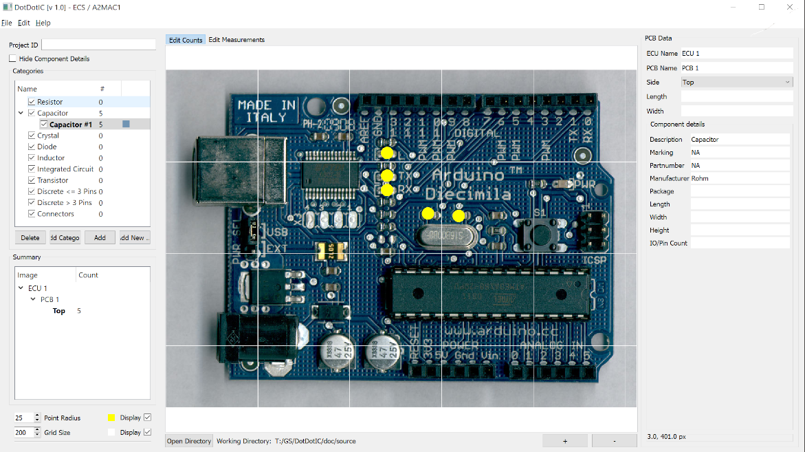

# DotDotIC
DotDotIC is a free, open source tool to assist with manually counting components on PCBs. It is based on DotDotGoose (https://github.com/persts/DotDotGoose)



*Point data collected with DotDotIC will be very valuable training and validation data for any future efforts with computer assisted counting*


## Installation

### Dependencies
DotDotIC is being developed on Windows 10 with the following libraries:

* PyQt5 (5.10.1)
* Pillow (5.4.1)
* Numpy (1.15.4)
* TKinter (3.6.7)


#### Windows and OSX
Once Python3 has been installed, you should be able to simply install the three dependencies .

```bash
pip install pillow
pip install numpy
pip install PyQt5
```

## Launching DotDotGoose

```bash
git clone https://github.com/pangeorg/DotDotIC
cd DotDotGoose
python3 main.py
```