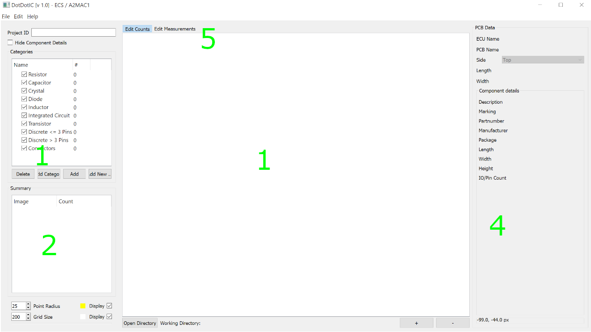

If you use this application on data that results in a publication, report, or online analysis, we ask that you include the following reference:

Ersts,P.J.[Internet] DotDotGoose (version 1.5.1). American Museum of Natural History, Center for Biodiversity and Conservation. Available from http://biodiversityinformatics.amnh.org/open_source/dotdotgoose. Accessed on [DOWNLOAD DATE].

.. raw:: latex

    \newpage

.. image:: CBC-AMNH-Logo.jpg
    :align: center

DotDotIC is a free, open source tool to assist with manually counting components on pcbs. 

The DotDotIC interface makes it easy to create and edit classes of components
to be counted and you can pan and zoom to accurately place points to identify individual objects. Information about components can be stored in 
dedicated fields and this metadata can be exported for use in spreadsheet or statistics software.

.. raw:: latex

    \section*{License}

DotDotIC is free software: you can redistribute it and/or modify
it under the terms of the GNU General Public License as published by
the Free Software Foundation, either version 3 of the License, or
(at your option) any later version.

DotDotIC is distributed in the hope that it will be useful,
but WITHOUT ANY WARRANTY; without even the implied warranty of
MERCHANTABILITY or FITNESS FOR A PARTICULAR PURPOSE.  See the
GNU General Public License for more details.

You should have received a copy of the GNU General Public License
along with with this software.  If not, see http://www.gnu.org/licenses/.

.. raw:: latex

    \newpage

User Interface
==============
The user interface has four main components.

Class Editor [1]
    This component allows you to add and delete categories and components for your project.

Point Summary [2]
    This component will display the images you have annotated and a summary of points counts by component. Double clicking on an image name in the summary window will automatically load that image and display the associated points and image data.

Image Display [3]
    This component will display your current image and the points associated with that image.

Image Data [4]
    This component allows you to store pcb and component details such as names and dimensions. The PCB Data fields can be edited to change name and placement in the projects structure by hitting enter.

|
|

    DotDotGoose user interface.

.. raw:: latex

    \newpage

Preparing Data
==============
DotDotIC was designed to work on a single directory of images at a time, which is a typical way of storing data from surveys or data collection events.

.. figure:: folder_structure.png

    Simple folder structure expected by DotDotIC

DotDotIC does not save the full image path in the project (pnt) file enabling you to easily move data around on your hard drive. 
As a result, you must save the project file in the same directory as your images.
Furthermore, DotDotIC will display an error message if you attempt to load images that are outside of the current working directory.

The working directory is automatically set when you,

    1. Load an existing project file, or
    2. Drag the first image(s) into the Image Display component, or
    3. Drag a folder of images into the Image Display component, or
    4. Drag a .pnt file into the Image Display component, or
    5. Click the folder icon to load a folder of images.

For example, if you start a new counting project by dragging in IMG_0007.JPG (Fig 2) **Survey 1** will become the working directory. You can also 
start a new counting project by dragging in the folder **Survey 1**. Attempting use an image from any other location other than **Survey 1** 
will result in an error message until your restart DotDotIC or press the reset button.

Image Formats
=============

DotDotIC should be able to load most single and three channel image formats and has been tested on images up to 1.5GB. 

*Note: Your computer's available RAM will be the limiting factor when loading very large images*

Collecting Points
=================
To begin collecting points,

    1. Drag one or more images or a folder of images from your file browser into the Image Display area.
    2. Click the [Add] button in the Class Editor to add a new class.
    3. Click the black box next to the new class name and assign a display color for that particular class.
    4. Click the class name to make it the 'active' class.
    5. Zoom into your targets using the mouse wheel or the zoom buttons.
    6. Pan around the image with a typical left-click drag motion.
    7. When you have centered your unmarked targets, press and hold the Ctrl (Linux & Windows) or Command (OSX) key then left-click to place a point on your target.

.. figure:: example.png

    Example counting project.

.. raw:: latex

    \section*{Tips and Notes}

* While panning or zooming you can press the 'd' key to toggle the points on and off.
* You can change the size of the points being displayed by adjusting the "Point Radius" value. To change this value, use the up and down arrows on the input field.
* You can change the default "active" class color from yellow to a color of your choice by clicking on the box next to the "Point Radius" input field.
* A grid is overlaid on the image to help focus your attention while counting. You can change the size of the grid and color of the grid.
* While panning or zooming you can press the 'g' key to toggle the grid on and off.
* While you can use a track pad with DotDotIC, it is highly recommended that you use a two button mouse with a scroll wheel.
* Point placement can be important for future uses of these count data so it is recommended that you carefully and consistently place your points.
* Selecting "Edit Measurements" changes to a meassuring mode. Pressing "C" and drawing a rectangle around the pcb in the image opens a window for calibrating the length of the pcb. 
This sets a new scale visible in the bottom right corner of the application. Now pressing "M" and again drawing rectangles, markers with the respective height and width are drawn and indicated.

Editing Points and Classes
==========================

Deleting Points
---------------
    1. Press and hold the Shift key then left-click and drag the mouse to draw a box around the point(s) you would like to delete.
    2. Once you release the mouse button the selected points will be highlighted with a red halo.
    3. Press the Delete key to remove the points.

Relabeling Points
-----------------
    1. Make a class active by clicking its name in the class editor.
    2. Press and hold the Shift key then left-click and drag to draw a box around the point(s) you would like to relabel.
    3. Once you release the mouse button the selected points will be highlighted with a red halo.
    4. Press the 'r' key to relabel the selected points to the active class.

Rename Class/Category
------------
Double click the class name in the class editor and enter a new name. Here you can also change the components category.

Rename ECU/PCB/ Top/Bottom
------------
Edit the text field in the PCB Data box and hit "Enter" which will commit the chaage to the name.

.. raw:: latex

    \newpage

Saving and Loading Point Data
=============================
You can save your point data to a file and reload them as needed. If you want to share the raw point data with another colleagues simply package / copy the directory containing the project (pnt) file and images. Save frequently!

Saving Point Data
-----------------
    1. Click the [Save] button to open the save file dialog.
    2. Enter a new file name or select and existing file to overwrite. *Note: You must save your project file in the same directory as your images*

Quick Save
-----------------
Windows & Linux
    1. Ctrl+S will save your point data to the last opened or saved point file. If not point file exists, a save file dialog will open.

OSX
    1. Command+S will save your point data to the last opened or saved point file. If not point file exists, a save file dialog will open.

Loading Point Data
------------------
    1. Click the [Load] button to open the file dialog.
    2. Select a project file to load.

.. raw:: latex

    \newpage

Exporting Count Data
====================
Clicking the [Export] button will open a file dialog where you will enter a new file name or select and existing file to overwrite.

There are three export options.

Counts
------
This option will export a summary of the counts and all custom fields in your project. There will be one line per image in your project.

    *survey_id, image_name, class_1_counts, class_2_counts, ... class_n_counts, x, y, custom_field_1, custom_field_2, ... custom_field_n*

This CSV file can then be read by your favorite spreadsheet or statistics software.

Points
------
This option will export a line for each point in your project.

    *survey_id, image_name, class_name, x, y*

Chips
-----
This option will export a chip or subimage centered on each point with a width and height of your choosing. 
A directory will be created for each class in your project. The directory selected for exporting image chips must be empty.
